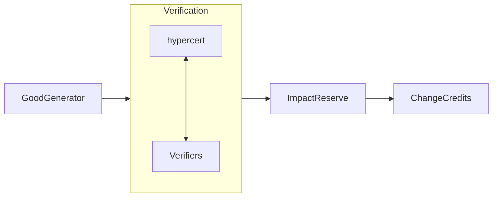

# Change Credits
This repository contains the source code for the smart contracts as well as the backend code for minting and managing Change Credits. Change Credits represent our first composable primitive to power _changenomics_, an initial step toward making impact economically sustainable.

## Overview

### Terminology, Integrations and Standards
* **Good Generators.** NGOs, social enterprises, and other organizations tokenizing and minting their impact via Change Code.
* **Partners.** Individuals, funds, and organizations purchasing and holding Change Credits from one or more Good Generators.
* **Verifiers.** Qualified experts actively reviewing and signing off on the impact outputs claimed by Good Generators.
* **[Hypercerts](https://hypercerts.org/docs/intro).** _Unverified_ impact claims setitng out a scope of impact, timebounds, and contributors, represented as semi-fungible ERC1155 tokens.
* **[Ethereum Attestation Service (EAS)](https://docs.attest.org/docs/welcome).** Tokenless, public good service supporting both onchain and offchain attestions.
* **Change Credits.** Composable and _verfied_ impact tokens linked to an individual Good Generator and represented as batched, non-fungible ERC721 tokens.
* **Impact Reserve.** Auditable onchain account acting as a repositiory of generated and verified impact from which Change Credits are minted, represented as ERC6551 token bound accounts.
## Token Evolution

#### Initial Impact Claims
When a Good Generator initially makes an impact claim (or a concurrent set of impact claims), data is captured onchain (and offchain) according to the hypercert token and metadata standard. Upon creation, the [owner](https://hypercerts.org/docs/minting-guide/step-by-step#owners) of hypercert is set as the Impact Reserve. As such the only fractionalization supported for hypercerts inside the Change Credits flow exists at the level of [contributors](https://hypercerts.org/docs/minting-guide/step-by-step#set-of-contributors). The purpose of this is to create a more composable and less conflated system of primitives in which the hypercert can more clearly and exclusively function as a claim to impact.
##### Subsequent Claims
In the event that a Good Generator's work on a project spans multiple cycles (e.g. carrying over years) or is active in multiple geographies, each of these components can be represented as its own hypercert. These multiple hypercerts will all feed into the same Impact Reserve but streamline and simplify the process of verification, especially in the event that verifiers may be local in only one geography or only available for part of the longer duration of the initative.
#### Verification
At the same time an Impact Reserve is launched onchain, it includes an updatble list of verifiers. Each hypercert owned by the Impact Reserve includes both a specified quorem of verifiers (m of n) and a sublist cooreponding to the verifiers required for that hypercert to pass as verified. Once a corresponding hypercert is minted, its set of verifiers are able to provide their reviews via the EAS. _(Choosing to leverage the EAS will hopefully in the future make the Change Credits protocol compatible with other EAS projects such as [Deresy](https://deresy.xyz/)._
#### Change Credit Minting
Based on the balance of verified impact units inside the Impact Reserve, partners can mint and purchase Change Credits at a price defined by the Good Generator. Each Change Credit is minted as a single NFT with a its number of impact units included as updatable metadata.
### Demand Drivers
There are various levers in place to entice parnters to mint and hold Change Credits, beyond of course any altruistic interest in impact or public goods. Change Credits are intended to be the start of the funnel and effectively the base asset of Change Code's economic flywheel.
* **Subsidized Retirement.** To catalyze interest, a Good Generator or their legacy philantropic backers may offer to commit a portion of donated funds (or in the case of a social enterprise, increased profits) to repurchase and retire a portion of its Change Credits, proportionally repurchasing them from current holders.
* **Follow-On Rights.** In the case of social enterprises, it's well understood that these projects often begin with subsizied capital that is later replaced with profit seeking capital. Coupled with the above notion of subsidized retirement, we might expect that as a social enterprise matures across multiple funding cycles the amount (and repurchase price) for subsidized retirements would increase. Holding Change Credits of an earlier vintage gives partners guaranteed participation rights to purchase future Change Credits from the organization.
* **Continuous Outcomes.** While the immediate _outputs_ of an impact initiative may be quickly realized, the delayed or secondary _outcomes_ take more time to be realized. Buliding an elementary school does not immediately produce a more educated workforce or increase household income. To recognize this, the impact units of _continuously_ held compounds over time.

## License
This repository is available as open-source under the [Mozilla Public License 2.0](/LICENSE). Click [here](https://www.mozilla.org/en-US/MPL/2.0/FAQ/) to learn more.

## Get Involved
To get involved in our work at Change Code, feel free to give us a follow on [Twitter](https://twitter.com/changecodeio), subscribe to our [newsletter](https://changecode.io/#terminal), or join our community and watch us _build in public_ over in [Console](https://app.console.xyz/c/changecode).
